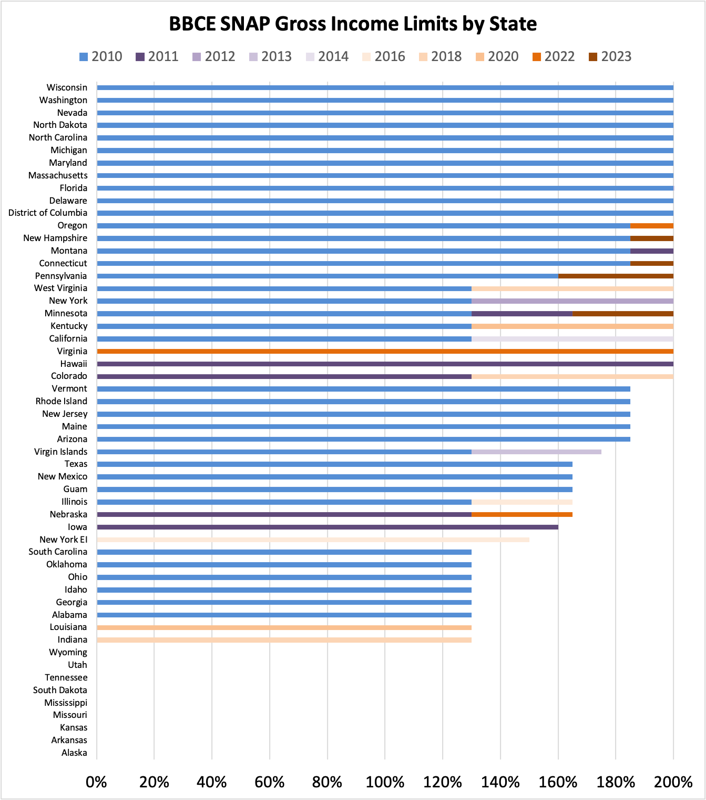

# SNAP BBCE History

State broad-based categorical eligibility (BBCE) changes from 2010-2023

## What is BBCE?

SNAP eligibility rules are set at a federal level, with two of the income requirements being:

- A gross income limit set at 130% of the Federal Poverty Level (FPL) 
- An asset limit of $2,750 (also known as the resource limit)

Households that include a member who is 60 or older or has a disability don't have to meet the gross income limit and have a higher asset limit. There is also a net income limit which under federal rules all households must meet.

Broad-based categorical eligibility (BBCE) is a policy that allows states to set their own income and asset limits for SNAP. If a state has a BBCE policy, they can add an alternative path to SNAP eligibility with increased gross income limits and increased or removed asset limits.

Here's the [USDA's definition:](https://www.fns.usda.gov/snap/broad-based-categorical-eligibility)

> Broad-based categorical eligibility (BBCE) is a policy in which households may become categorically eligible for SNAP because they qualify for a non-cash Temporary Assistance for  Needy Families (TANF) or State maintenance of effort (MOE) funded benefit ... BBCE cannot limit eligibility. Households that are not eligible for the program that confers categorical eligibility may apply for and receive SNAP under regular program rules. Under regular program rules, SNAP households with elderly or disabled members do not need to meet the gross income limit, but must meet the net income limit.

States can increase the gross income limit for SNAP up to 200% FPL. This analysis looks at how states have changed their income limits over time.

## Gross Income Limit Changes



### Notes

Chart shows the BBCE gross income limits as reported in the BBCE dataset. States that are at 0% on the chart still have SNAP eligibility under the federal eligibility rules, which have a 130% gross income limit. 

Some datapoints were removed to make the chart more readable. 

- Arizona had a few months increase from 185% to 200% in 2012
- Florida had a few months decrease from 200% to 130% in 2013
- Louisiana removed BBCE in 2014, added back in 2020
- Mississippi removed BBCE in 2018

## Income Limits

Monthly income limits by household size for 130% to 200% FPL.

|Household Size|100% FPL | 130% FPL |200%  FPL|
|--------------|-------|-------|-------|
|1             |$1,133 |$1,473 |$2,266 |
|2             |$1,526 |$1,984 |$3,052 |
|3             |$1,920 |$2,495 |$3,840 |
|4             |$2,313 |$3,007 |$4,626 |
|5             |$2,706 |$3,518 |$5,412 |
|6             |$3,100 |$4,029 |$6,200 |
|7             |$3,493 |$4,541 |$6,986 |
|8             |$3,886 |$5,052 |$7,772 |
|9             |$4,280 |$5,564 |$8,560 |
|10            |$4,674 |$6,076 |$9,348 |

The FPL is updated each year. FPL as of [October 2022 - October 2023](http://services.dpw.state.pa.us/oimpolicymanuals/snap/568_Computing_Eligibility_and_Benefit_Amount/568_Appendix_A.htm).

## Month-to-Month Changelog

### 2010.11

- HI: Added BBCE at 200% and no asset limit
- MO: Gross Income 185% → 200%

### 2011.01

- CA: "Only households with children under 18" → All households
- IA: Added BBCE at 160% and no asset limit

### 2011.03

- CO: Added BBCE at 130% and no asset limit
- MD: "Only households that include related children age 17 or under or a related child age 18 or 19 who will graduate from high school by 19 (referral to services on application)" → All households
- MN: Gross Income 130% → 165%

### 2011.06

- WA: "Non-assistance households" → All households

### 2011.10

- MI: No Asset Limit → $5,000 (includes vehicles over $15,000 fair market value)
- NE: Added BBCE at 130% and $25,000 asset limit

### 2012.01

- AZ: Gross Income 185% → 200%
- ID: No asset limit → $5,000
- MI: "$5,000 (includes vehicles over $15,000 fair market value)" → "$5,000 (first vehicle is excluded; other vehicles with fair market value over $15,000 are counted)"
- NY: All households → "Households with dependent care expenses"

### 2012.05

- PA: No Asset Limit → "$9,000 for elderly and disabled; $5,000 for all other households"

### 2012.11

- AZ: Gross Income 200% → 185%
- FL: Gross Income 200% → 130%
- NY: Gross Income 130% → 200%
- PA: Increase asset limit from $5,000 to $5,500

### 2013.06

- FL: Gross Income 130% → 200%

### 2013.07

- VI: Gross Income 130% → 175%

### 2014.07

- CA: Gross Income 130% → 200%

### 2014.12

- LA: Removed BBCE

### 2015.04

- PA: Removed asset test

### 2015.08

- ME: New asset test of $5,000

### 2016.01

- IL: Gross Income 130% → 165%

### 2016.08

- NY: New separate gross income limit for households with earned income at 150%
- TX: "Asset limit of $5,000 (excludes 1 vehicle & includes excess vehicle value)" → "Asset limit of $5,000 (excludes 1 vehicle up to $15,000 & includes excess vehicle value)"

### 2018.10

- CO: Gross Income 130 → 200%
- IN: Added BBCE at 130% and $5,000 asset limit
- WV: Gross Income 130% → 200%

### 2019.07

- MS: Removed BBCE

### 2019.12

- [MI](https://www.thecentersquare.com/michigan/article_0a7cf39e-20b3-11ee-aa16-f35db1afe245.html): Asset $5000 → $15,000, no longer counting vehicles

### 2020.05

- KY: Gross Income 130% → 200%
- LA: Added BBCE at 130% and no asset limit
- ME: Removed asset limit

### 2022.06

- [NE](https://www.wowt.com/2021/05/26/nebraskans-struggling-to-comeback-from-pandemic-push-for-snap-bill/): Gross Income 130% → 165%
- [OR](https://kval.com/news/local/oregon-now-offers-food-day-care-help-to-people-earning-200-federal-poverty-level): Gross Income 185% → 200%
- [VA](https://vplc.org/snap-expansion-what-you-need-to-know/): Added BBCE at 200% and no asset limit

### 2023.01

- [CT](https://yaledailynews.com/blog/2022/10/05/connecticut-increases-snap-eligibility-benefits/): Gross Income 185% → 200%
- [MN](https://www.mprnews.org/story/2022/06/14/legislature-boosts-snap-eligibility): Gross Income 165% → 200%
- NH: "Households with at least one dependent child and a specified relative to that child" → All households
- [NH](https://www.thecentersquare.com/new_hampshire/article_e51716d0-3b47-11ed-87da-fbcdbf45d92c.html): Gross Income 185% → 200%
- [PA](https://www.penncapital-star.com/blog/changes-to-snap-income-thresholds-will-expand-eligibility-for-benefits-wolf-admin-says/): Gross Income 160% → 200%

### 2023.07

- [MI](https://www.wkar.org/wkar-news/2023-07-13/michigan-eliminates-asset-test-for-food-assistance): Removed asset limit

## Data 

### Dataset

- The ```data``` folder contains CSVs of the BBCE rules by state from 2010.08 to 2023.07

### Source

- [USDA.gov](https://www.fns.usda.gov/snap/broad-based-categorical-eligibility)

### Footnotes included with data 
1. This column represents the gross income limit for the TANF-funded benefit for households with no elderly or
disabled members. All income limits are percentages of the Federal Poverty Guidelines (FPG).
2. In these states, households with seniors or people with disabilities and gross income under 200 percent of poverty
do not face an asset limit. Those over 200 percent of poverty are not categorically eligible and do face a $3,000
asset limit.
3. Households containing childless adults ages 18-59 and who are not disabled have a gross income limit of 130
percent of FPG. (Massachusetts)

### Other Notes
- Louisiana increased their BBCE income limit from 130% to 200% on [July 1, 2022](http://www.dss.louisiana.gov/news/as-extra-snap-benefits-end-recipients-encouraged-to-update-info-assess-options), however this update does not appear in the BBCE dataset and is not included in the chart
- Dataset may be missing changes between 2020-05 and 2022-06
- Florida states 130% FPL in 2012-11, however has 200% FPL both a few months before and after
- Arizona states 200% FPL in 2012-01 and 2012-11, however has 185% FPL both a few months before and after